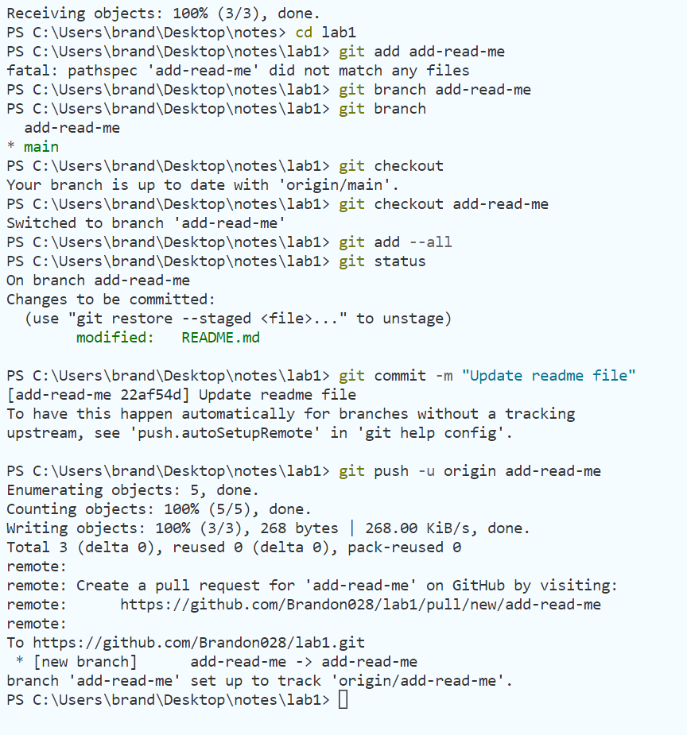
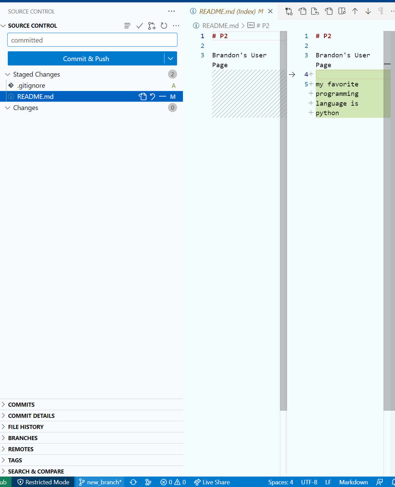

## picture: 







## me as a programmer
 I consider myself and entry level to intermediate programmer, but I want to get to the level of a **software engineer**. 
 
> "software engineering is a label applied to a set of current practices for software development. Using the word engineering to describe this activity takes considerable liberty with the common use of that term." - Mary Shaw, Software Architecture. 

My favorite python package is pandas because it makes working with data very easy.

```python
import pandas as pd

df = pd.DataFrame()
```

here is the relative link to the [README](README.md)

## me as a person

section link to me as a programmer: [pro](https://github.com/Brandon028/P2/edit/main/HW1%20Part%203.md#me-as-a-programmer)

my favorite animals in no order are:
- tuna
- sea bass
- sardine

my favorite foods in order are:
1. tuna
2. chicken
3. vegetables

things i want to do today is:
- [x] shower
- [ ] wash my hair
- [ ] eat tuna


